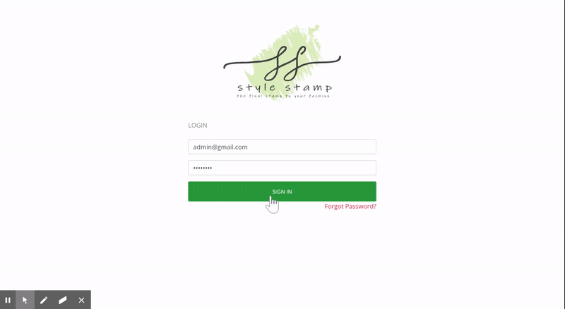

# StyleStamp

**Version 1.0.0**

StyleStamp is an ecommerce android application to sell fashion accessories with a website for admin user to manage products, categories, orders and user information. Created functions in settings and order model to retrieve data from database, added controller for loading and passing data to view orders page and worked on the functionality for admin to view or delete orders on website. Also created rest APIs to  filter products, retrieve customer profile, cancel order, create order, get orders by user, get orders by status, verify login and retrieve settings. Technologies used were Codeigniter, PHP, JavaScript, JQuery, Ajax, Android Studio, Java, XAMP, MySQL.

**Languages and Frameworks used: Codeigniter, PHP, JavaScript, JQuery, Ajax, Android Studio, Java, XAMP, MySQL

---

## Installation
Github Link : https://github.com/dawnNM/StyleStamp. 

## Demo Link
Project Link : http://stylestamp.c1.biz/  
(Test Admin User - Username : admin@gmail.com, Password : Abc@1234 )

---
### Stylestamp Demo

---

## Contributors
* Backend
	- Dawn Mathews
	- Priyanka Thakker
	- Jeel Gandhi
	- Trinadha Reddy 
* Frontend
	- Gaganpreet kaur
	- Gagandeep banger
	
---

## License & copyright

© Dawn Mathews, Priyanka Thakker, Jeel Gandhi, Trinadha Reddy, Gaganpreet kaur, Gagandeep banger
